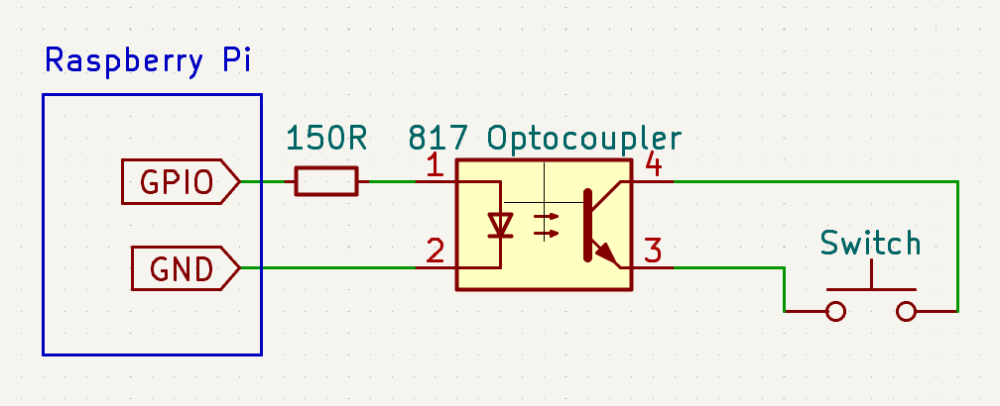

# Keyboard Latency Tester

## Hardware Setup

This project uses identical hardware to [LagBox](https://hci.ur.de/projects/latency/howto).

- Rasbperry Pi
- A817 optocoupler (or equivalent)
- 150 ohm resistor

Connect pin 1 of the optocoupler through a 150 Ohm resistor to a GPIO pin on the Raspberry Pi, then connect pin 2 to a ground pin. By default, this script uses GPIO 21, but this can be changed with the `--gpio` option.

Connect pins 3 and 4 of the optocoupler to either side of a switch on the keyboard to test.


-+

## Software Setup

Clone this repo, then open a terminal to the repo directory and install dependencies:

```bash
pip install -r requirements.txt
```

## Usage

To print a list of the attached keyboards, run:

```bash
./test --list
```

Some keyboards will appear as multiple input devices. If you aren't sure which one is correct, you can scan to see which one responds to a triggered key press:

```bash
./test --scan
```

To test the keyboard at index 2, run:

```bash
./test -i 2
```

If there is only one keyboard or it's the first in the list, you can omit the `-i` argument.

To write the results to a CSV file, add `-o` followed by the file name:

```bash
./test -o result.csv
```

For a full list of options, run:

```bash
./test --help
```

## Test Methodology

This script uses the optocoupler to simulate a press of the attached switch. It then watches for a key press event on the selected input device and learns which key code is triggered.

It then runs the following process the number of iterations specified with `-n` (default 100):

1. Wait a random amount of time.
2. Record the current time and simulate a key press by setting the trigger GPIO on.
3. Wait for a key press event for the correct key.
4. Record the difference in time between the trigger GPIO being set and the key event.
5. Release the key by setting the trigger GPIO off.

For step 1, the script creates a list of delays evenly distributed between `--tmin` (default 50 ms) and `--tmax` (default 1 s), then randomly assigns a delay to each iteration. This attempts to ensure that the latency tester does not run in lock step with any process on the keyboard such as key scanning, which might artificially increase or decrease the tested latency compared to real-world usage.

For step 2, the script records the time before and after the call to change the GPIO and uses the average. The potential error +/- that average value is recorded in a second column for each sample.

For step 4, the script uses the event timestamp reported by the OS, so it isn't affected by how long it takes to handle each event.

## Results

The `results` folder contains test results for various keyboards. Files are organized as follows:

```
results/<firmware>/<keyboard>/<interface>-<interface_speed>[-<debounce_type>].csv
```

For example, `results/zmk/nrf5340dk-zmk-uno/usb-1000hz-debounce-5ms` would be:

- ZMK Firmware
- [nRF5340 DK](https://www.nordicsemi.com/Products/Development-hardware/nRF5340-DK) with [ZMK Uno](https://github.com/zmkfirmware/zmk-uno) shield
- Keyboard connected via USB with 1000 Hz polling
- Keyboard debounce set to 5 milliseconds

### Interface

- Bluetooth keyboards: `ble-<connection_interval>`, e.g. `ble-15ms`
- USB keyboards: `usb-<polling_rate>`, e.g. `usb-1000hz`

#### ZMK

USB poll rate defaults to 1000 Hz but can be changed with:

```ini
CONFIG_USB_HID_POLL_INTERVAL_MS=8  # poll rate = 1000 Hz/value
```

BLE connection interval defaults to 7.5-15 ms. It can be forced to a specific interval by changing the min and max values:

```ini
CONFIG_BT_PERIPHERAL_PREF_MIN_INT=6 # interval = value * 1.25 ms
CONFIG_BT_PERIPHERAL_PREF_MAX_INT=6 # interval = value * 1.25 ms
```

### Debounce

Debounce algorithms differ slightly between firmwares. The debounce types refer to the following settings.

#### KLL

[KLL debounce documentation](https://github.com/kiibohd/controller/blob/master/Scan/Devices/MatrixARMPeriodic/README.md)

`debounce-7ms`

```c
MinDebounceTime = 7;
```

#### QMK

[QMK debounce documentation](https://docs.qmk.fm/#/feature_debounce_type?id=types-of-debounce-algorithms)

`debounce-5ms`

```ini
# No options set. Equivalent to
DEBOUNCE_TYPE = sym_defer_g
DEBOUNCE = 5
```

`debounce-eager-5ms`

```ini
DEBOUNCE_TYPE = asym_eager_defer_pk
DEBOUNCE = 5
```

#### ZMK

[ZMK debounce documentation](https://zmk.dev/docs/features/debouncing)

`debounce-5ms`

```ini
CONFIG_ZMK_KSCAN_DEBOUNCE_PRESS_MS=5
CONFIG_ZMK_KSCAN_DEBOUNCE_RELEASE_MS=5
```

`debounce-eager-5ms`

```ini
CONFIG_ZMK_KSCAN_DEBOUNCE_PRESS_MS=0
CONFIG_ZMK_KSCAN_DEBOUNCE_RELEASE_MS=5
```

`debounce-eager-1ms-5ms`

```ini
CONFIG_ZMK_KSCAN_DEBOUNCE_PRESS_MS=1
CONFIG_ZMK_KSCAN_DEBOUNCE_RELEASE_MS=5
```

### Charting Results

The `results` folder contains a Jupyter notebook for visualizing the results.

First, install dependencies:

```
pip install -r requirements.chart.txt
```

Then open [`results/chart.ipynb`](results/chart.ipynb) in [Visual Studio Code](https://code.visualstudio.com/) or [Jupyter](https://docs.jupyter.org/en/latest/install.html) and run all cells.

## Credits

Testing hardware is taken from [LagBox](https://hci.ur.de/projects/latency/howto) and the operation of the test script was derived from the [LagBox software documentation](https://github.com/PDA-UR/LagBox/blob/master/README.md).

Keyboard event handling is based on the Python [keyboard](https://github.com/boppreh/keyboard) library.
